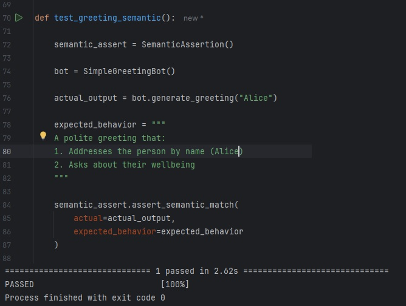
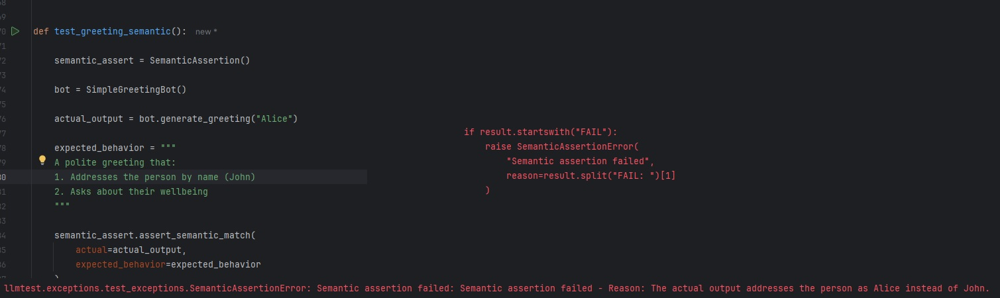

# llmtest

A semantic testing framework for LLM applications that uses LLMs to validate semantic equivalence in test outputs. Built with clean architecture principles and designed for CI/CD integration.

## Why llmtest?

Testing LLM applications is challenging because:
- Outputs are non-deterministic
- Semantic meaning matters more than exact matches
- Traditional testing approaches don't work well
- Integration into CI/CD pipelines is complex

llmtest solves these challenges by:
- Using LLMs to evaluate semantic equivalence
- Providing a clean, maintainable testing framework
- Offering simple CI/CD integration
- Supporting multiple LLM providers

Imagine this (well you don't have to imagine, this is the test package actually doing its job):

Asserting on something that passes:



Asserting on something that fails:



Reliably in the test package of your LLM App. This is what llmtest is for.

## Installation

```
pip install git+https://github.com/Shredmetal/llmtest.git
```


## Quick Start

1. Create a `.env` file in your project root:

```
OPENAI_API_KEY=your-openai-api-key-here

OR

ANTHROPIC_API_KEY=your-anthropic-key-here
```

2. Write your tests:

```
from llmtest.core.semantic_assert import SemanticAssertion

# API key will be loaded from environment

asserter = SemanticAssertion()

# Test semantic equivalence

my_llm_output = my_llm_function(prompt="tell me that the sky is blue").content # this is pseudocode, use your LLM app instead

actual_output = my_llm_output
expected_behavior = "A statement about the color of the sky"

asserter.assert_semantic_match(
    actual=actual_output,
    expected_behavior=expected_behavior
)
```

Full example:

```
def test_greeting_semantic():

    semantic_assert = SemanticAssertion()

    bot = SimpleGreetingBot() # Initialise LLM (check ./tests/test_content_generators/test_greeting_bot.py

    actual_output = bot.generate_greeting("Alice") 

    expected_behavior = """ # Use natural language to describe what you expect to get out of the bot
    A polite greeting that:
    1. Addresses the person by name (Alice)
    2. Asks about their wellbeing
    """

    semantic_assert.assert_semantic_match( # call the assert_semantic_match method
        actual=actual_output,
        expected_behavior=expected_behavior
    )
```

## Usage with pytest

```
import pytest 
from llmtest.core.semantic_assert import SemanticAssertion

class TestMyLLMApp: 

    @pytest.fixture 
    def asserter(self): # API key loaded from .env 
        return SemanticAssertion()
        
    def test_my_llm_function(self, asserter):
    result = my_llm_function()
    asserter.assert_semantic_match(
        actual=result,
        expected_behavior="Should provide a coherent answer about Python"
    )

```

## Features

- **Two Frontier LLM Providers**: Support for OpenAI and Anthropic
- **Clean Architecture**: 
  - Separation of concerns
  - Easy to extend
  - Maintainable codebase
- **Flexible Configuration**:
  - Environment variables
  - Direct configuration
  - Multiple model support
- **Robust Error Handling**:
  - Semantic assertion errors
  - Configuration validation
  - Connection handling
- **CI/CD Ready**:
  - Fast execution
  - Clear pass/fail results
  - Environment variable support

## Configuration

Configuration via environment variables (in `.env`):

Provider Selection:
```
LLM_PROVIDER=openai # or 'anthropic'
```
API Keys:
```
OPENAI_API_KEY=your-openai-key 
ANTHROPIC_API_KEY=your-anthropic-key
```
Optional Configuration:
```
LLM_MODEL=gpt-4o # or other supported models 
LLM_TEMPERATURE=0.0 
LLM_MAX_TOKENS=4096 
LLM_MAX_RETRIES=2
```

Or programmatically (not recommended for API keys):

```
asserter = SemanticAssertion(api_key="your-api-key", # Optional: Use env vars instead 
                             provider="openai", # Optional: 'openai' or 'anthropic' 
                             model="gpt-4o", # Optional: See supported models 
                             temperature=0.0, # Optional: 0.0-1.0 
                             max_tokens=4096, # Optional: Default 4096 
                             max_retries=2 # Optional: Default 2 
                             )
```

## Supported Models

Note: I only support frontier models because of their semantic matching capabilities - you can disable the model type validation in the source code if you wish.

### OpenAI
- gpt-4o
- gpt-4-turbo

### Anthropic
- claude-3-5-sonnet-latest
- claude-3-opus-latest

## Error Handling

The library provides specific exceptions:

```
from llmtest.exceptions.test_exceptions import (SemanticAssertionError, # When semantic matching fails 
                                                LLMConnectionError, # When LLM service fails 
                                                LLMConfigurationError # When configuration is invalid )
```

## Contributing

This project is at an early stage, but aims to be an important testing library for LLM applications. Contributions are welcome in:
- Additional LLM provider support
- Performance optimisations
- Test coverage improvements
- Documentation
- CI/CD integration examples
- Test result caching
- And literally anything else if you see a possible improvement opportunity (Please adhere to clean code principles though)


## License

MIT

## Acknowledgments

Created to solve the critical need for reliable, practical testing of LLM applications in production environments where we have to ship these apps out and test them at a reasonable cost.