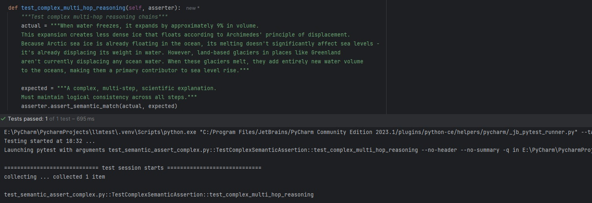

# llmtest

A semantic testing framework for LLM applications that uses LLMs to validate semantic equivalence in test outputs. 

✨ Test your LLM apps in minutes, not hours

🚀 CI/CD ready out of the box

💰 Cost-effective testing solution

🔧 No infrastructure needed

You can click [here](#documentation) to go straight to the docs.

Important note: This is still being tested prior to release on PyPI, please refer to the branch: feat/find-a-way-to-break-this and look in the tests directory to see where we're at on the dumbest edge cases (e.g. 100 emojis).

## Screenshots

What if you could just use:

```
semantic_assert.assert_semantic_match(
        actual=actual_output,
        expected_behavior=expected_behavior
    )
```
and get a pass/fail to test your LLM apps? Well, that's what I'm trying to do. Anyway, seeing is believing so:

Here's llmtest passing a test case:


Here's llmtest failing a test case (and providing the reason why it failed):


Finally, here's llmtest passing a test case with a complex reasoning chain with the simple, natural language 
instruction of:

```
A complex, multi-step, scientific explanation.
Must maintain logical consistency across all steps.
```



## Why llmtest?

Testing LLM applications is challenging because:
- Outputs are non-deterministic
- Semantic meaning matters more than exact matches
- Traditional testing approaches don't work well
- Integration into CI/CD pipelines is complex

llmtest solves these challenges by:
- Using LLMs to evaluate semantic equivalence
- Providing a clean, maintainable testing framework
- Offering simple CI/CD integration
- Supporting multiple LLM providers

## Quick Example

```
from llmtest.semanticassert.semantic_assert import SemanticAssertion

semantic_assert = SemanticAssertion() 
semantic_assert.assert_semantic_match(actual="Hello Alice, how are you?", 
                                      expected_behavior="A polite greeting addressing Alice" 
                                      )
```


## Installation

```
pip install git+https://github.com/Shredmetal/llmtest.git
```


## Documentation

Full documentation available at: [https://Shredmetal.github.io/llmtest/](https://Shredmetal.github.io/llmtest/)

- Installation Guide
- Quick Start Guide
- API Reference
- Best Practices
- CI/CD Integration
- Configuration Options

## License

MIT

## Contributing

This project is at an early stage and aims to be an important testing library for LLM applications. 

Want to contribute? Great! Some areas we're looking for help:
- Additional LLM provider support
- Performance optimizations
- Test coverage improvements
- Documentation
- CI/CD integration examples
- Test result caching
- Literally anything else you can think of, I'm all out of ideas, I'm not even sure starting this project was a smart one.

Please:
1. Fork the repository
2. Create a feature branch
3. Submit a Pull Request

For major changes, please open an issue first to discuss what you would like to change, or YOLO in a PR, bonus points if you can insult me in a way that makes me laugh.

Please adhere to clean code principles and include appropriate tests... or else. 🗡️

## Contact

morganj.lee01@gmail.com